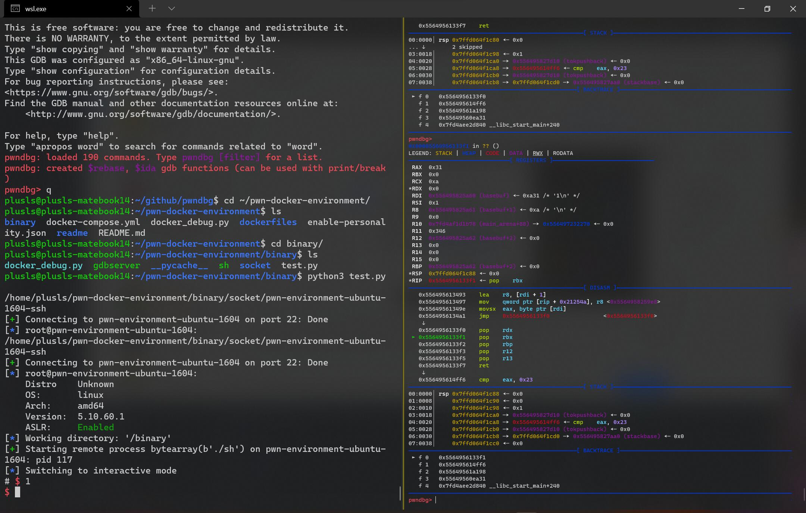

# pwn-docker-environment

Debug pwn in docker, no need for virtual machines


## Introduction

Did you debug pwn in a virtual machine?

Are you still worried about the virtual machine taking up too much hard disk?


Try this!

Just need to install the basic libraries in docker, you can debug the program as usual!

The docker image will take up very little space.


## Quick Start

### Linux

1. Install docker and docker-compose pwndbg

2. Add your user to docker group.

3. Install requirements:

   ```bash
   pip3 install pwntools --user
   ```

4. Install pwn-docker-environment.

   ```bash
   git clone https://github.com/plusls/pwn-docker-environment.git
   cd pwn-docker-environment
   docker-compose up -d
   ```

5. Run test script

   ```bash
   cd binary
   python3 test.py
   ```

### Screenshot

1. wsl2 + tmux

    

2. wsl2 + windows terminal

    


### Tips

1. You can link `docker_debug.py` to `~/.local/lib/{python_version}/site-packages/docker_debug.py`

   ```bash
   ln -s ~/pwn-docker-environment/docker_debug.py ~/.local/lib/{python_version}/site-packages/docker_debug.py
   ```

2. You can add `cp-pwn` script to `~/.local/bin` to quick copy binary to docker

   example:

   ```bash
   #!/bin/bash
   cp -r $1 ~/pwn-docker-environment/binary/.
   ```

   You can use it like this:

   ```bash
   cp-pwn ./mybinary
   ```
   
   You also can add alias in `.bashrc`

   ```bash
   alias cp-pwn='_cp_pwn(){ if [ ! -n "$1" ] ;then echo "cp-pwn <filename>";else cp -r $1 ${HOME}/pwn-docker-environment/binary/.; fi}; _cp_pwn'
   ```

3. When use windows terminal with wsl2, you can add config to `~/.config/pwn.conf`

    ```
    [context]
    terminal=['wt.exe', '-w', '0', 'split-pane', 'wsl.exe', '-e']

    [update]
    interval=never
    ```

3. When use tmux, you can add config to `~/.config/pwn.conf`

    ```
    [context]
    terminal=['tmux', 'splitw', '-h']

    [update]
    interval=never
    ```
