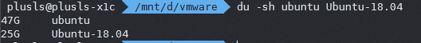
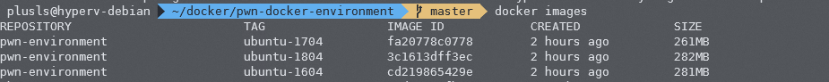
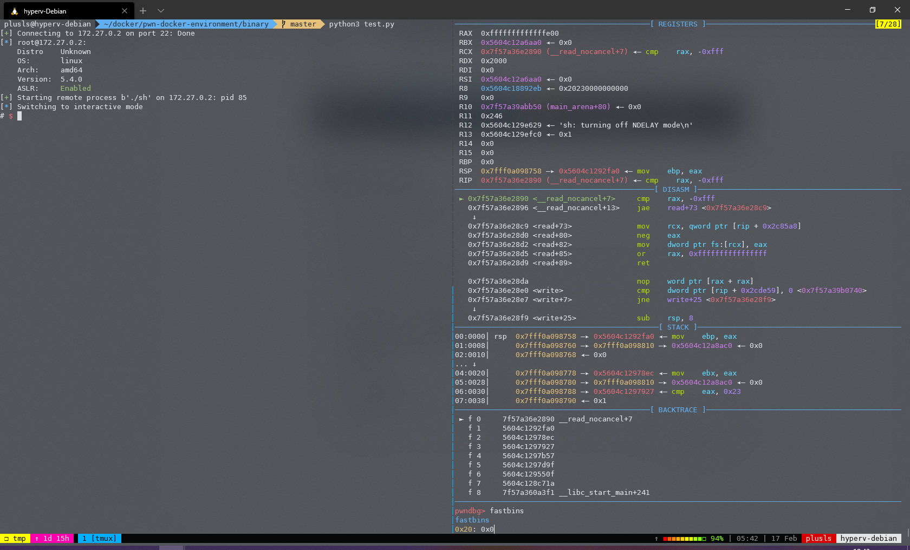
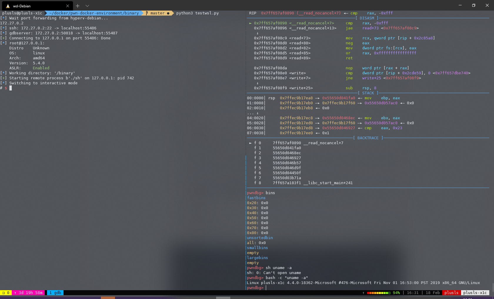

# pwn-docker-environment

Debug pwn in docker, no need for virtual machines


## Introduction

Did you debug pwn in a virtual machine?

Are you still worried about the virtual machine taking up too much hard disk?



Try this!

Just need to install the basic libraries in docker, you can debug the program as usual!

The docker image will take up very little space.




## Quick Start

### Linux

1. Install docker and docker-compose pwndbg

2. Add your user to docker group.

3. Install requirements:

   ```bash
   pip3 install docker pwntools asyncssh --user
   ```

4. Install pwn-docker-environment.

   ```bash
   git clone https://github.com/plusls/pwn-docker-environment.git
   cd pwn-docker-environment
   docker-compose up -d
   ```

5. Run test script

   ```bash
   cd binary
   python3 test.py
   ```
   

### WSL1 or local machine that cannot run docker

It also can be used to connect server's docker, but the debugging experience is not good.

#### In server:

1. Install docker and docker-compose

2. Add your user to docker group.

3. Install pwn-docker-environment.

   ```bash
   git clone https://github.com/plusls/pwn-docker-environment.git
   cd pwn-docker-environment
   docker-compose up -d
   ```

4. Use Public Key Authentication with SSH (Login without password)

#### In WSL1

1. Install  pwndbg

2. Add your user to docker group.

3. Install requirements:

   ```bash
   pip3 install docker pwntools asyncssh --user
   ```

4. Install pwn-docker-environment.

   ```bash
   git clone https://github.com/plusls/pwn-docker-environment.git
   cd pwn-docker-environment
   ```

5. Run test script

   ```bash
   cd binary
   python3 wsltest.py
   ```

   

### Tips

1. Can link `docker_debug.py` to `~/.local/lib/{python_version}/site-packages/docker_debug.py`

   ```bash
   ln -s ~/docker/pwn-docker-environment/docker_debug.py ./
   ```

2. Can add `cp-pwn` script to `~/.local/bin` to quick copy binary to docker

   example:

   ```bash
   #!/bin/bash
   cp -r $1 ~/docker/pwn-docker-environment/binary/.
   ```

   You can use it like this:

   ```bash
   cp-pwn ./mybinary
   ```
   
